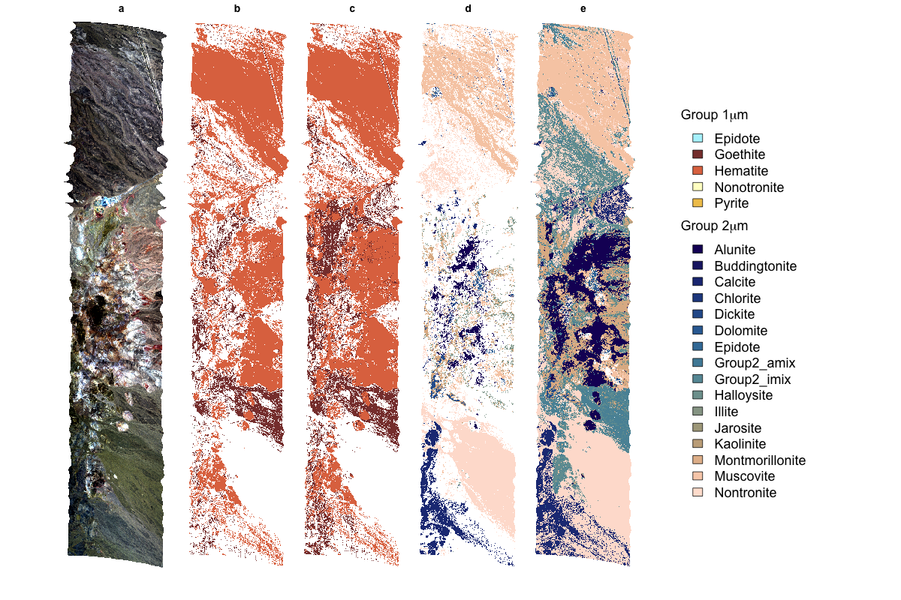
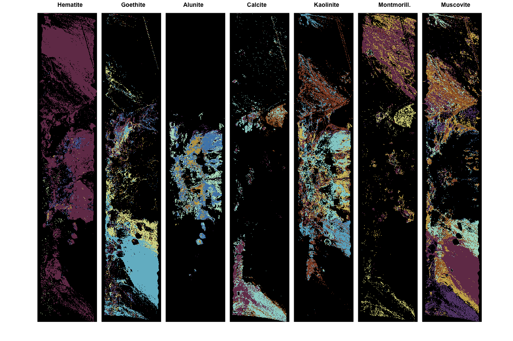
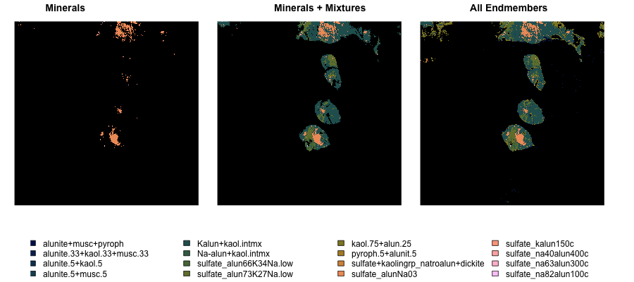

# visualize tetracorder outputs

Code used for making figures for https://github.com/CMLandOcean/MineralDetection

*whole image minerals and mineral mixtures*

`plots-whole-area.R`

*whole image all endmembers*

`plots-whole-area_Ntot.R`

*zoom in compare aggregation levels*

`plots-zoom_alunite.R`
